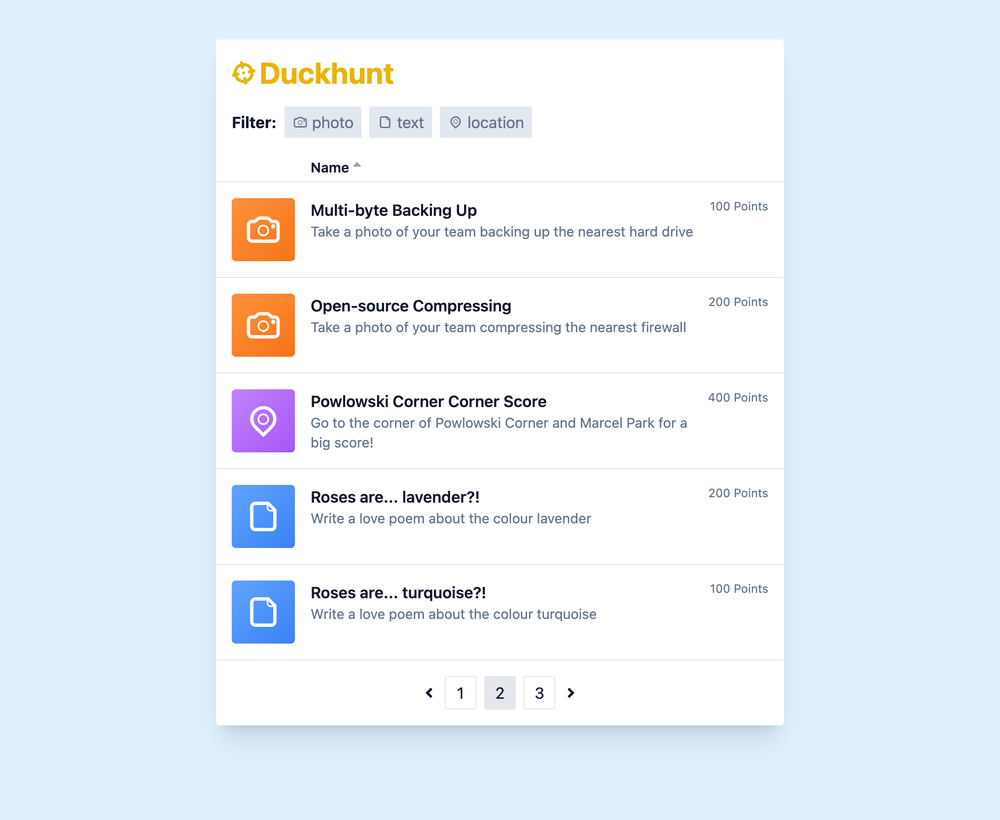

# Duckhunt

### a Goosechase challenge

##### by Dan Lichty

## Requirements

- Node.js (tested on 16)
- NPM
- Docker

## Running the app

1. Clone this repo to your machine
1. Navigate to `database/` and run `docker-compose up` to start the database container (it runs on port 5432)
1. Run `npm run reset` to migrate and seed the database
1. Navigate back up to `graphql/` and run `npm run dev` to start the GraphQL API
1. Navigate back up to `client/` and run `npm run dev` to start the React application
1. Visit http://localhost:3000 to see the app in action

## Technologies

### Infrastructure

- Docker
- PostgreSQL
- NPM
- dotenv

### Backend

- Apollo Server
- GraphQL codegen
- Knex

### Frontend

- Next.js
- React
- Tailwind CSS
- Apollo Client
- GraphQL codegen
